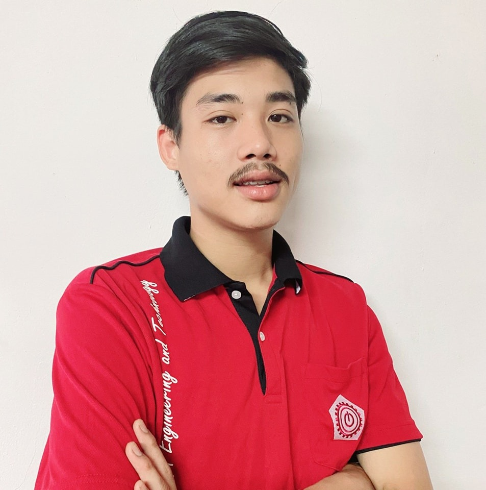

<html lang="en">
<head>
  <link rel="stylesheet" href="stye.css">
  <link href="https://cdn.jsdelivr.net/npm/bootstrap@5.2.2/dist/css/bootstrap.min.css" rel="stylesheet" integrity="sha384-Zenh87qX5JnK2Jl0vWa8Ck2rdkQ2Bzep5IDxbcnCeuOxjzrPF/et3URy9Bv1WTRi" crossorigin="anonymous">
  
  <meta charset="UTF-8">
  <meta http-equiv="X-UA-Compatible" content="IE=edge">
  <meta name="viewport" content="width=, initial-scale=1.0">
  <title>Formdumdin</title>
</head>
<body style="color: #311b92;">
  <nav class="navbar navbar-expand-lg bg-light">
    

      <a class="navbar-brand" href="#">Thanyapat Sornwiset</a>
      <button class="navbar-toggler" type="button" data-bs-toggle="collapse" data-bs-target="#navbarNav" aria-controls="navbarNav" aria-expanded="false" aria-label="Toggle navigation">
        
      </button>
      

        <ul class="navbar-nav">
          <li class="nav-item">
            <a class="nav-link" >home</a>
          </li>
          <li class="nav-item">
            <a class="nav-link" href="Report.html">About me</a>
          </li>
          <li class="nav-item">
            

            <a class="nav-link" href="contact.html">contract</a>
            

          </li>
          <li class="nav-item">
            <a class="nav-link " href="http://pim.ac.th">Panyapiwat Institute of Management</a>
          </li>
        </ul>
      

    

  </nav>
  <body>

    <<h1>ธัญญพัฒน์ ศรวิเศษ</h1>
    
<em><strong>สาขา วิศวะกรรมดิจิตอลและเทคโนโลย</strong></em>

  <a href="http://pim.ac.th"> 
สถาบันการจัดการปัญญาภิวัฒน์
</a>
    

 
<ul>
  สวัสดีครับผมนายธัญญพัฒน์ ศรวิเศษ ชื่อเล่น ฟอร์ม ผู้คนมักรู้จักผมในชื่อว่า ฟอร์ม ดำดิน
  เป็นคนเฟลลี่ครับชอบทำความรู้จักกับผู้คนที่พบเจอ ชอบในการเขียนโปรแกรมและเว็ปไซต์
  เวลาที่ผมนั้นได้ทำมันผมรู้สึกเป็นตัวเองเเละมีรความสุขทุกครั้งที่ได้ทำมัน
</ul>
    <h3>การศึกษา</h3>
    <ul>.
      <li>มัธยมต้น(ม.1-3)</li>
    <a href="https://sites.google.com/site/jirasartwitthaya/khxmul-rongreiyn">

      โรงเรียนจิระศาตร์วิทยา
</a>
      เกรดเฉลี่ย 3.35
       
       
      <li>มัธยมปลาย (ม.4-6)</li>
      <a href="https://satitvru.ac.th/">
โรงเรียนสาธิตมหาวิทยาลัยราชภัฏวไลยอลงกรณ์ ในพระบรมราชูปถัมภ์  
</a>
      เกรดเฉลี่ย 3.33
       
       
      <li>ปริญญาตรี</li>
      
<a href="http://pim.ac.th"> 
สถาบันการจัดการปัญญาภิวัฒน์(ปัจจุบันกำลังศึกษาอยู่)
</a>

      เกรดเฉลี่ย 3.43
  </ul>

<h3>ประสปการ์ณในการฝึกงาน</h3>
<ul>
  <li>ทำงานเซเว่นมาเเล้วทั้งหมด1ปี</li>
  <li>เคยมีประสปการ์ณในการฝึกงานที่เซเว่นเป็นเวลา3เดือน</li>
  <li>ตอนทำงานเซเว่นมีประสปการ์ณในการฝึกงานในตำแหน่งเดลิเวอรี่และได้เจอลูกค้าหลากหลายรูปแบบ</li>
  <li>เคยมีประสปการ์ณในการทำงานในบริษัท ไอที</li>
</ul>
  </body>
